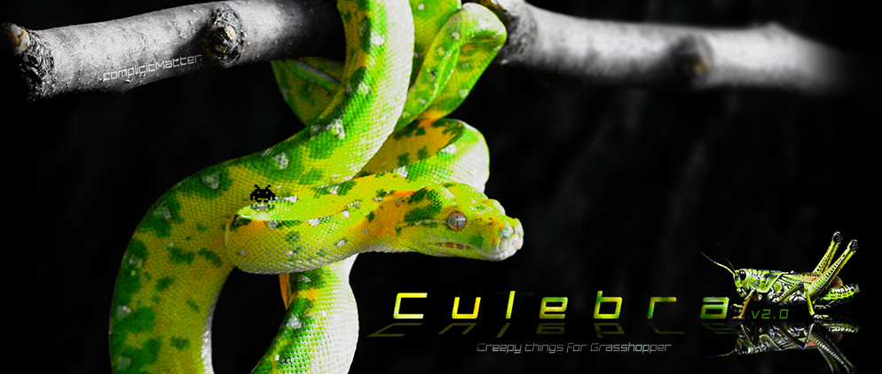

#### CULEBRA LIBRARY ####
Culebra is a live agent based C# library and plugin for Grasshopper. A collection of objects and behaviors for creating dynamic multi agent interactions.
2D|3D Multi Object Behavior library focused on hybrid system interactions with custom Visualization, Data, and performance features.

####Updates for Culebra 2.0####
* Complete Rewrite from Version 1
* Using Culebra Java library

#####Behavioral Updates#####
* New Flocking Behavior - Flockers Behavior Type Class Implements Flock Behavior Interface
* Wandering Behavior - Wanderer Behavior Type Class Implements Wander Behavior Interface, the base Wander behavior is from Craig Reynolds and Daniel Shiffman.
* New Noise Behavior - Improved Perlin Noise Behavior Type Class Implements Noise Behavior Interface. 
* Tracking Behavior - Path, Shape and multiShape Tracker Behavior Type Class Implements Tracking Behavior Interface. 
* BabyMakers Behavior - Objects can spawn children under the right conditions. Objects can have type specific behaviors. For example, if you are a "Parent" object or object of type Creeper or Seeker or you derrive from these classes then you can create children, however if you are of type BabyX then you no longer have the capability to spawn children.
* Mesh Crawler - Mesh Crawler Behavior Class. 
* Forces – Attract, Repel and other force methods inside the controller class.

#####Performance Updates#####
* Display Conduit – Simulations can run in 2 modes - Graphics or Geometry mode with massive performance gains in graphics mode
* RTree Search Optimizations – Implementation of RTree for performance 
* Zombie and Live mode for simulations

#####Culebra Data DLL#####
* Access to Culebra classes and methods through the dll
* Expanded capabilities not available in the Culebra Grasshopper plugin

#####Culebra GHA#####
* Will expand on the components built in version 1

#### RELEASES ####
* TBD
